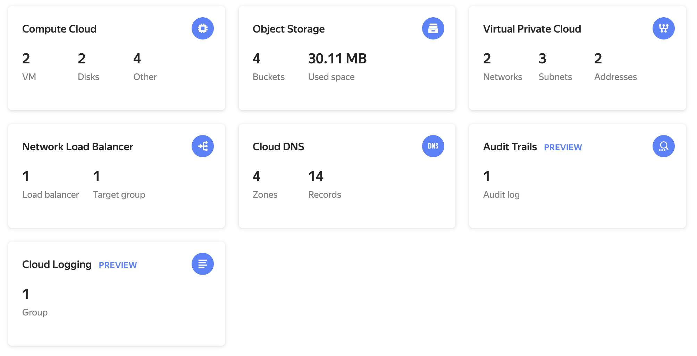
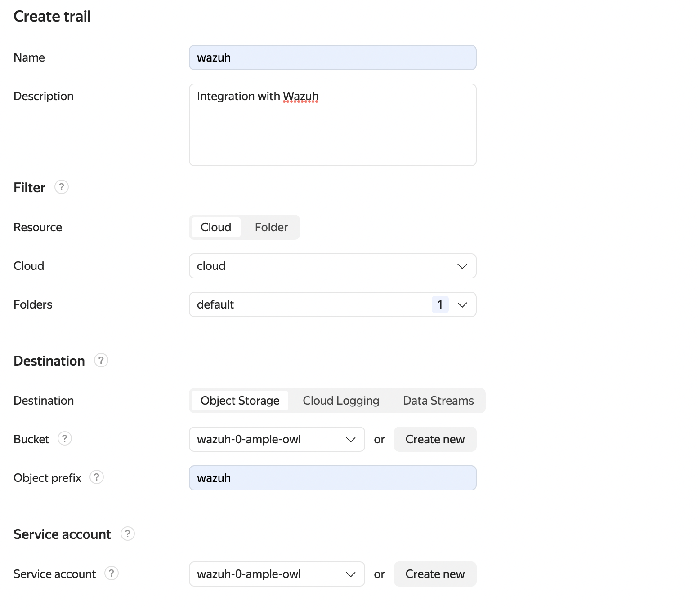
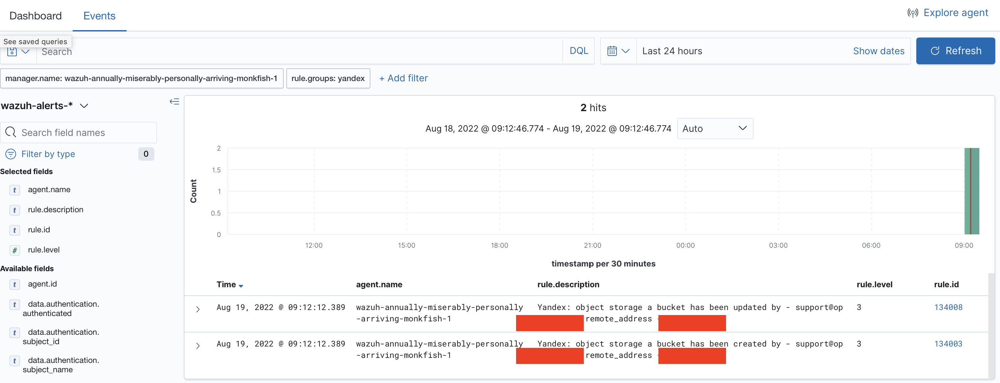

## Интеграция Yandex cloud с Wazuh
Вашему вниманию представляется пример как можно интегрировать  [Wazuh](https://wazuh.com/) для анализа [Yandex Audit Trails](https://cloud.yandex.ru/docs/audit-trails/)

Прежде чем интегрировать давайте пройдем небольшой чек-лист:
Необходимо 
 - [Yandex Audit Trails](https://cloud.yandex.ru/docs/audit-trails/)
 - Terraform не ниже версии v1.1.3
 - Packer не ниже версии v1.7.8
 - YC_FOLDER_ID и YC_TOKEN 

## Подготовка образа
Прежде чем создавать инфраструктуру, необходимо собрать новый [образ](https://cloud.yandex.ru/docs/compute/concepts/image) с помощью [Packer](https://www.packer.io/plugins/builders/yandex)

Меняем директорию
```shell
cd packer
```
В базовой конфигурации в сборку будет включены два wodle, wodle это Wazuh module.
Первый wodle для интеграции с Yandex Audit Trails и второй для сканирование [Yandex Object Storage](https://cloud.yandex.ru/docs/storage/) на предмет вирусов с помощью [ClamAV](https://www.clamav.net/)

### Основные переменные для Ansible роли

## Ansible variables 
`packages_to_install` - Список пакетов для установки:
```yanl
packages_to_install:
    - python3-pip
    - awscli
    - apt-transport-https
    - curl
    - lsb-release
    - unzip
    - wget
    - libcap2-bin
    - software-properties-common
    - gnupg2
    - net-tools
    - htop
```
`pip_packages_to_install` - Список python модулей, которые будут установлены в систему
```yaml

pip_packages_to_install:
    - docker==4.2.0
    - boto3
```
`wazuh_pip_packages` - Список python модулей, которые будут установлены для внутреннего framework
```yaml

wazuh_pip_packages:
    - clamd
```
`clamav_packages` - Список пакетов для интеграции с ClamAV
```yaml
clamav_packages:
    - clamav-daemon
    - clamav-freshclam
    - clamav
```
`wazuh_version` - Версия Wazuh
```yaml
wazuh_version: "4.3"
```
`yandex_wazuh_app_url` - Url для Kibana приложения
```yaml

yandex_wazuh_app_url: "https://artifacts.comcloud.xyz/wazuh-1.2.0.zip"
```
`local_mirror` - Настройка использования локального зеркала для ClamAV
```yaml

local_mirror: true
```
`local_mirror_url` - Доменное имя локального зеркала
```yaml

local_mirror_url: "clamav.comcloud.xyz"
```
`use_clamav` - Использовать или нет интеграцию с ClamAV
```yaml
use_clamav: true
```
`yandex_wodle_url` - URL где расположен wodle для интеграции с Yandex Audit Trails(на данный момент менять не нужно)
```yaml
yandex_wodle_url: "https://artifacts.comcloud.xyz/yandex.py"
```

Фактически при использовании настроек по-умолчанию вы получите полностью настроенный образ со всеми интеграциями
Далее необходимо клонировать правила для Yandex cloud, переходим в директорию `ansible/roles/wazuh/files` и клонируем с github(необходимо использовать последний [релиз](https://github.com/opennix-solutions/wazuh-yandex-cloud-rules/releases))
```shell
cd ansible/roles/wazuh/files

git clone  --depth 1 --branch  v0.1.0 https://github.com/opennix-solutions/wazuh-yandex-cloud-rules.git rules

```
После настройки переменных можно приступать к сборке, начале экспортируем переменные

```shell

export YC_TOKEN=$(yc iam create-token)
export YC_FOLDER_ID=$(yc config get folder-id)

```
После этого запускаем сборку образа(запускаем в папке `packer`)
```shell
packer build .
```
После сборки вы получите id нового образа
```shell
==> Builds finished. The artifacts of successful builds are:
--> yandex.wazuh: A disk image was created: wazuh-19-aug-22-03-25-59 (id: fd84rq5trb9f3sck0vqk) with family name 
```

После того как мы собрали образ, можно приступать к разворачиванию инфраструктуры
Переходим в директорию `terraform/deployment` и задаем переменные такие как, 
 - folder_id
 - cloud_id
 - image_id

Инициализируем 

```shell
terraform init
```

Выполняем plan

```shell
terraform plan
```

Проверьте результат и запустите разворачивание

```shell
terraform apply
```
После завершения Wazuh WebUI будет доступна по адресу https://${lb_ip}

## Логины и пароли
Все логины и пароли хранятся локально на  сервере в архиве `/var/ossec/wazuh-install-files.tar`
Подключитесь по ssh к серверу, перейдите в папку /var/ossec/ и распакуйте архив.
## Схема 


## Настройка Yandex Audit Trails

Перейдите в Yandex cloud webui

Перейдите в Audit Trails 

Создайте новый tail

Заполните следующие поля

Name/Имя - Имя Trail например wazuh

Resource/Ресурс - Выбираем нужное, в моем случае я выбрал Облако

Cloud/Облако - выбираем ваше облако

Folders/Каталоги - выбираем нужные каталоги

Destination/Назначение - выбираем Object storage

Bucket/Бакет - Выбираем бакет которые был создан через terraform

Object prefix/Префикс объекта - Префикс задаем wazuh

Service account/Сервисный аккаунт - Выбираем сервис аккаунт, который был создан через terraform

После этого наживаем создать. Через некоторое время Audit Trail начнет писать события в бакет

## Wazuh WebUI Yandex application
В реализации используется оригинальное Wazuh kibana приложение с добавлением специфики для Yandex cloud


При нажатии на иконку "Yandex cloud" и при наличии trails вы должны видеть примерно следующую картину


При переходе к событиям(Events), появляется возможность поиска в классическом синтаксисе

Например последние события 



Так же если включена интеграция с ClamAV, то мы можем искать уже события связанные с обнаружением вирусов в бакетах 
Для этого с главного экрана нужно перейти в Security events и далее выбрать Events


В данном примере мы видим следующее:
`data.url` который нам показывает что по пути `~/tmp/scan/clamav/eicarcom2.zip` найден вирус Win.Test.EICAR_HDB-1(e4968ef99266df7c9a1f0637d2389dab:308) в архиве eicarcom2.zip.

Путь до вируса формируется следующим образом `base_directory/bucket_name/object_name`, в примере выше вирус был найден в бакете clamav.

После сканирования папка очищается тем самым локально не хранятся вирусы. 

Впоследствии такой подход будет изменен на более оптимальный

## Авторские права и отказ от ответственности
ЭТА ПРОГРАММА ПРЕДОСТАВЛЕНА ВЛАДЕЛЬЦАМИ АВТОРСКИХ ПРАВ И/ИЛИ ДРУГИМИ СТОРОНАМИ «КАК ОНА ЕСТЬ» БЕЗ КАКОГО-ЛИБО ВИДА ГАРАНТИЙ, ВЫРАЖЕННЫХ ЯВНО ИЛИ ПОДРАЗУМЕВАЕМЫХ, ВКЛЮЧАЯ, НО НЕ ОГРАНИЧИВАЯСЬ ИМИ, ПОДРАЗУМЕВАЕМЫЕ ГАРАНТИИ КОММЕРЧЕСКОЙ ЦЕННОСТИ И ПРИГОДНОСТИ ДЛЯ КОНКРЕТНОЙ ЦЕЛИ. НИ В КОЕМ СЛУЧАЕ НИ ОДИН ВЛАДЕЛЕЦ АВТОРСКИХ ПРАВ И НИ ОДНО ДРУГОЕ ЛИЦО, КОТОРОЕ МОЖЕТ ИЗМЕНЯТЬ И/ИЛИ ПОВТОРНО РАСПРОСТРАНЯТЬ ПРОГРАММУ, КАК БЫЛО СКАЗАНО ВЫШЕ, НЕ НЕСЁТ ОТВЕТСТВЕННОСТИ, ВКЛЮЧАЯ ЛЮБЫЕ ОБЩИЕ, СЛУЧАЙНЫЕ, СПЕЦИАЛЬНЫЕ ИЛИ ПОСЛЕДОВАВШИЕ УБЫТКИ, ВСЛЕДСТВИЕ ИСПОЛЬЗОВАНИЯ ИЛИ НЕВОЗМОЖНОСТИ ИСПОЛЬЗОВАНИЯ ПРОГРАММЫ (ВКЛЮЧАЯ, НО НЕ ОГРАНИЧИВАЯСЬ ПОТЕРЕЙ ДАННЫХ, ИЛИ ДАННЫМИ, СТАВШИМИ НЕПРАВИЛЬНЫМИ, ИЛИ ПОТЕРЯМИ, ПРИНЕСЕННЫМИ ИЗ-ЗА ВАС ИЛИ ТРЕТЬИХ ЛИЦ, ИЛИ ОТКАЗОМ ПРОГРАММЫ РАБОТАТЬ СОВМЕСТНО С ДРУГИМИ ПРОГРАММАМИ), ДАЖЕ ЕСЛИ ТАКОЙ ВЛАДЕЛЕЦ ИЛИ ДРУГОЕ ЛИЦО БЫЛИ ИЗВЕЩЕНЫ О ВОЗМОЖНОСТИ ТАКИХ УБЫТКОВ.

## Ссылки
[Wazuh Documentation](https://documentation.wazuh.com/current/index.html)

[Yandex Audit Trails](https://cloud.yandex.ru/docs/audit-trails/)

[Wazuh Yandex RuleSet](https://github.com/opennix-solutions/wazuh-yandex-cloud-rules)

[Wazuh Prometheus exporter](https://github.com/pyToshka/wazuh-prometheus-exporter)

[Wazuh Docker agent](https://github.com/pyToshka/docker-wazuh-agent)

[Wazuh Terraform module for kubernetes](https://github.com/pyToshka/terraform-wazuh-kubernetes-module) внимание в данном модуле нет интеграции с Yandex Cloud
## Создатель и кого пинговать

[pyToshka](https://github.com/pyToshka) 
